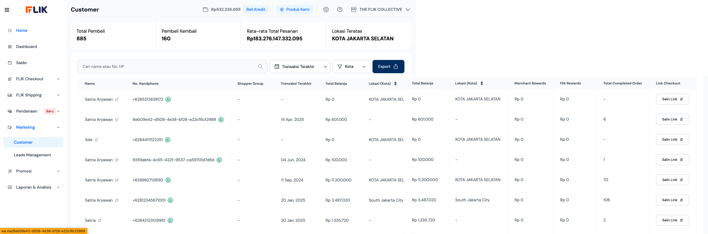
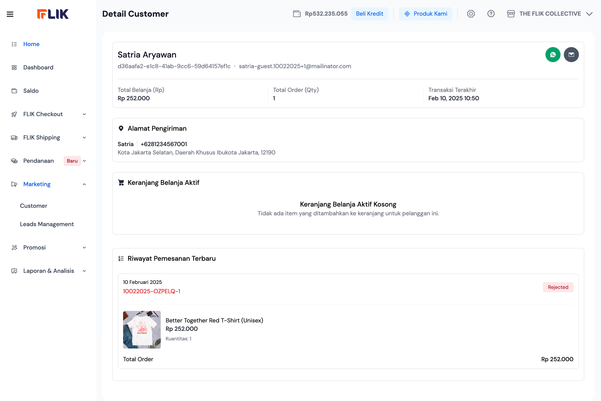

# FLIK CRM Gap Analysis

**Author:** VP of Product (AI Persona)  
**Target Audience:** Engineering, Product, and Design Teams  
**Date:** March 10, 2026

## Executive Summary
FLIK CRM provides a solid foundation for "Shopper Knowledge," functioning as a centralized repository for customer behavior. The tool excels at providing high-level merchant metrics and a clean "Detail View" for individual shopper history. However, it currently functions as a **reactive database**; to scale, it must evolve into an **active engagement engine** by layering in automation and predictive insights.

---

## 1. Feature Purpose & Merchant Journey
The CRM is designed to help merchants transition from transactional order-taking to relationship management.
*   **Discovery**: Merchants use the dashboard to track growth (Total Pembeli) and loyalty (Pembeli Kembali).
*   **Support & Engagement**: The "List View" enables rapid outreach via the direct WhatsApp integration.
*   **Customer Profiling**: The "Detail View" aggregates LTV (Total Belanja), order frequency, and physical shipping addresses.

---

## 2. UX and Interface Evaluation
| Metric | Rating | Observation |
| :--- | :--- | :--- |
| **Interface Clarity** | High | Dashboard cards provide an immediate business "pulse." |
| **Organization** | High | Logical transition from macro (list) to micro (profile). |
| **Engagement Potential**| High | Inline WhatsApp icons are a major utility win for social commerce. |
| **Hierarchy** | High | Order status (e.g., "Rejected") is clearly visualized in history. |

---

## 3. Critical Product Gaps
*   **Shopper Grouping (Segmentation)**: The "Shopper Group" column exists but is currently manual or unpopulated. There is no automated categorization (e.g., "Big Spender," "New Shopper").
*   **Engagement Logging**: No history of previous merchant-to-customer communications; it relies on the merchant's memory or external chat history.
*   **Active Recovery**: The "Keranjang Belanja Aktif" (Active Cart) feature appears present but underutilized. Recovering these carts is the highest-ROI activity for a CRM.
*   **Notes & Metadata**: Merchants cannot add "private notes" to a customer profile to track specific preferences or warnings.

---

## 4. Flow Friction Analysis (The "Top 5")

### 1. Silent Data Points
High-level stats like "Lokasi Teratas" (Top Locations) are view-only. 
*   **Friction**: Merchants cannot click the "Jakarta" card to instantly see or message those customers.

### 2. Disconnected Cart Recovery
Seeing an "Active Cart" in the detail view is great, but there is no one-click "Nudge" button to send a reminder link.
*   **Friction**: Higher barrier to converting abandoned carts.

### 3. Manual Grouping
Lack of dynamic rules to segment customers based on spending or COD history.
*   **Friction**: Forced manual labor for list management.

### 4. Search & Filter Depth
The current search is limited to Name/Phone. 
*   **Friction**: Cannot filter by "High LTV" or "Frequent RTO" (Return to Origin) customers.

### 5. Reactive Support Flow
Merchants have to wait for a customer to complain before checking their profile.
*   **Friction**: No proactive alerts (e.g., "Warning: VVIP customer order is late").

---

## 5. Strategic Recommendations

1.  **"High-Risk" COD Flagging**: Leverage ecosystem data to flag customers with a history of rejected COD orders across the FLIK network.
2.  **Automated Cart Recovery**: Add a "Send Checkout Reminder" button that automatically creates a unique payment link for items in the "Active Cart."
3.  **Dynamic Segmentation**: Create auto-populating lists like "Loyal" (3+ orders) and "At Risk" (no orders in 60 days).
4.  **WhatsApp Broadcasts**: Allow merchants to send bulk updates to specific segments (e.g., "Free shipping for everyone in Jakarta today").

---

## 6. Visual Reference

| Customer Dashboard | Customer Detail View |
| :---: | :---: |
|  |  |

---

## 7. Industry Benchmarks
*   **Shopify**: Sets the standard for customer "tags" and easy integration with email/marketing stacks.
*   **Klaviyo**: Focused on **predictive analytics** (Expected Date of Next Order).
*   **AfterShip**: Focuses on the **post-purchase experience** as the primary CRM touchpoint.
