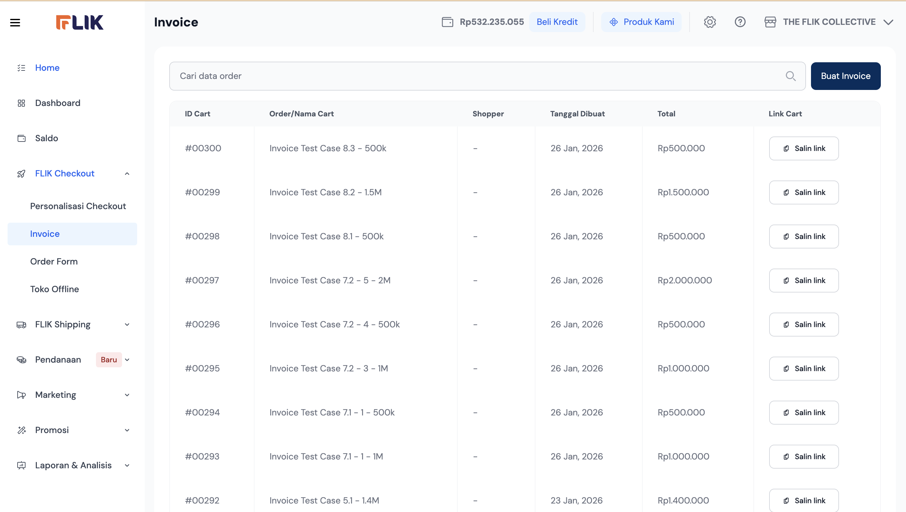
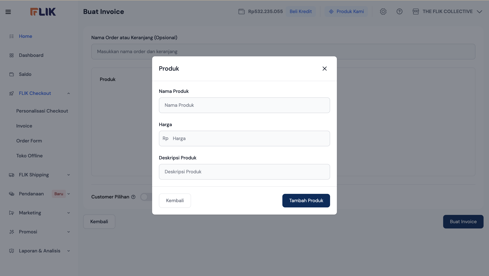
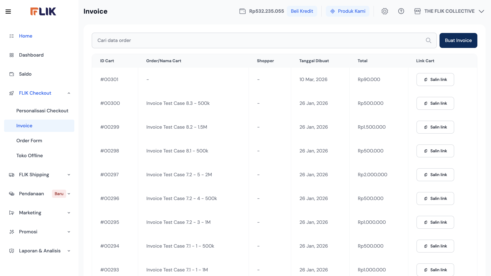

# FLIK Invoice Design Gap Analysis

**Author:** VP of Product (AI Persona)  
**Target Audience:** Engineering, Product, and Design Teams  
**Date:** March 10, 2026

## Executive Summary
FLIK Invoice Creator functions as a high-speed payment link generator, optimized for social commerce merchants (WhatsApp/Instagram sellers). While the flow is exceptionally linear and has low cognitive load, it currently functions more as a "link generator" than a "payment management system" due to gaps in status visibility and post-link automation.

---

## 1. Reconstructed Merchant Journey
Based on the UI analysis, the merchant follows a 3-step loop:

1.  **Initiation**: Merchant accesses the Invoice dashboard and triggers "Buat Invoice."
2.  **Configuration**: 
    *   Optional naming of the cart for tracking.
    *   Adding products (utilizing "Custom Product" for speed/flexibility).
    *   Toggling "Customer Pilihan" to link to specific shoppers.
3.  **Distribution**: The system generates a "Link Cart." The merchant copies the link ("Salin Link") to distribute via chat apps.

---

## 2. UX and Interface Evaluation
| Metric | Rating | Observation |
| :--- | :--- | :--- |
| **Speed of Creation** | High | Modal-based custom product entry is very fast. |
| **Usability** | High | Clear, single-purpose screens; minimal distraction. |
| **Clarity** | Medium | Dashboard lacks status indicators; empty names ("-") hinder reconciliation. |
| **Cognitive Load** | Low | Minimal fields required to generate a valid payment link. |

---

## 3. Critical Product Gaps
*   **Payment Status Visibility**: The dashboard shows amounts but lacks "Paid/Unpaid/Expired" badges. Merchants cannot verify collection within this view.
*   **Link Expiry Settings**: No ability to set a time-to-live (TTL) for links, risking overselling of limited inventory.
*   **Customer Preview**: No way for the merchant to preview the customer's checkout experience before sending the link.
*   **Reconciliation Silo**: The Invoice flow and Shipping flow appear disconnected; an invoice should ideally "auto-trigger" a shipping draft once paid.

---

## 4. Flow Friction Analysis (The "Top 5")

### 1. Anonymous Dashboard Entries
Allowing the "Nama Order" to be optional results in a dashboard filled with "-" entries, making it impossible to search for specific orders later.
*   **Impact**: Operational inefficiency during reconciliation.

### 2. Manual Distribution Step
The flow ends at "Copy Link." Forcing a manual paste into WhatsApp adds friction.
*   **Impact**: Slower "Time-to-Collection."

### 3. Repetitive Custom Input
Merchants selling the same high-frequency items must type Name and Price manually every time.
*   **Impact**: High friction for semi-standardized sellers.

### 4. No Running Total Visibility
During multi-product creation, the merchant doesn't see a clear sum of the invoice until it's finalized.
*   **Impact**: Potential for calculation errors.

### 5. Lack of Actionable Status
Without a "Paid" status in the list, the "Salin link" button remains the only action, even if the link is no longer needed.
*   **Impact**: Dashboard clutter.

---

## 5. Strategic Recommendations

1.  **Status & Auto-Reconciliation**: Integrate real-time payment status (Pending, Paid, Expired) with color-coded badges.
2.  **Direct WhatsApp Integration**: Add a dedicated "Share to WhatsApp" button with a customizable message template.
3.  **Auto-Order Naming**: If left blank, the system should auto-fill with "Order #[ID]" or shopper name.
4.  **Soft-Inventory Lock**: Link invoices to inventory to "reserve" items for a set duration (e.g., 2 hours) once the link is created.

---

## 6. Visual Reference

| Step 1: Dashboard | Step 2: Custom Product | Step 3: Distribution |
| :---: | :---: | :---: |
|  |  |  |

---

## 7. Industry Benchmarks
*   **Stripe Payment Links**: Sets the standard for "no-code" payment collection with built-in tax and address collection.
*   **Xendit (Local)**: Provides advanced analytics on link clicks vs. conversion rates.
*   **Shopify Draft Orders**: Excels at converting a paid invoice directly into a fulfillment/shipping task.
