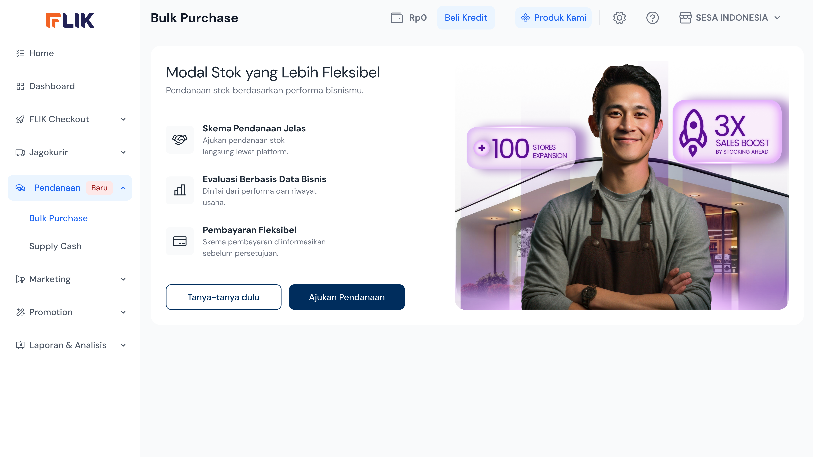
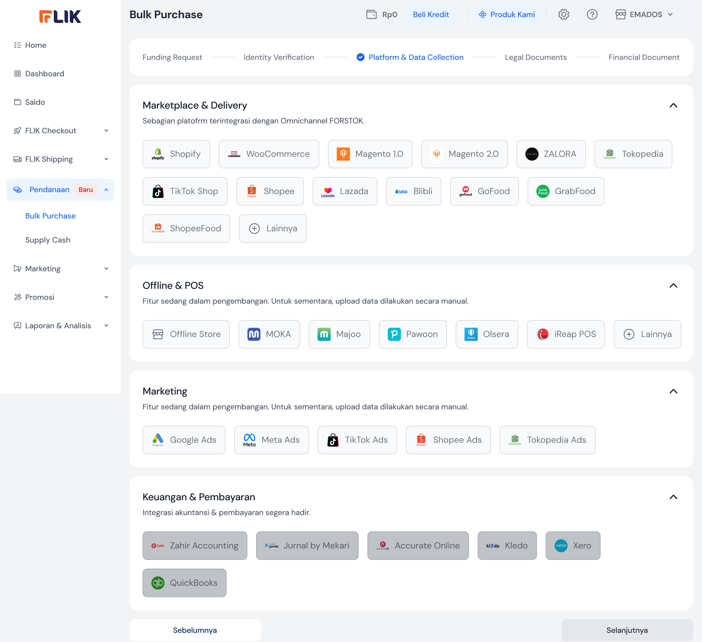
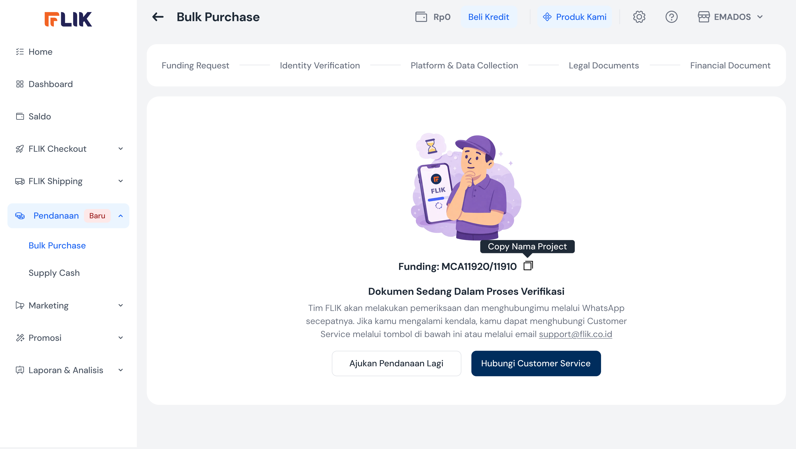

# FLIK MCA Design Gap Analysis

**Author:** VP of Product (AI Persona)  
**Target Audience:** Engineering, Product, and Design Teams  
**Date:** March 10, 2026

## Executive Summary
FLIK Merchant Cash Advance (MCA) provides a robust, professional-grade "Bulk Purchase" financing flow. Its primary strength lies in its **Omnichannel Data Integration** (Shopify, TikTok Shop, etc.), which allows for performance-based lending. However, the current experience is **high-friction**, requiring significant manual document uploads that could lead to high drop-off rates at the "Identity" and "Legal Document" steps.

---

## 1. Reconstructed Merchant Journey
The journey is a traditional 6-step risk-assessment and regulatory flow:

1.  **Value Proposition**: Merchant lands on a landing page explaining flexible funding and performance-based evaluations.
2.  **Request Input**: Merchant defines the funding amount, tenure, and business metrics (Business Age, Gross Margin).
3.  **Identity Verification**: Uploading KTP/NIK for directors and owners (the first major friction wall).
4.  **Data Collection**: Connecting sales channels (e.g., TikTok Shop, Shopee) and Omnichannel partners (e.g., FORSTOK).
5.  **Legal & Financial**: Uploading corporate documents (Akta, SK Kemenkumham, NPWP) and bank statements.
6.  **Review & Submit**: Accepting T&Cs via a third-party partner (CLIK) and receiving a tracking ID (e.g., MCA11920).

---

## 2. UX and Interface Evaluation
| Metric | Rating | Observation |
| :--- | :--- | :--- |
| **Interface Clarity** | High | Modern, clean UI with a clear stepper to manage long forms. |
| **Trust Indicators** | High | Visible KOMINFO/ISO badges and official partner logos (CLIK). |
| **Transparency** | Low | No calculator or clear repayment simulation early in the flow. |
| **Cognitive Load** | High | Heavy documentation requirements feel more like a bank than a SaaS. |

---

## 3. Flow Friction Analysis (The "Top 5")

### 1. Manual Documentation Wall (Screen 9)
Forcing merchants to find and upload "Akta Pendirian" and "SK Kemenkumham" is a massive drop-off point for social sellers and small D2C brands.
*   **Impact**: High abandonment at the 75% mark.

### 2. Technical Integration Hurdles (Screens 7-8)
Requiring "Secret Keys" or "ID FORSTOK" requires merchants to leave the app to find technical credentials.
*   **Impact**: Flow breakage; merchants may not return once they leave.

### 3. "Blind" Application
Merchants apply for large amounts without seeing a calculated interest rate or service fee upfront.
*   **Impact**: "Sticker shock" later in the process or hesitation to submit.

### 4. Redundant Performance Data (Screen 2)
Asking for "Estimated Gross Margin" and "Business Age" when FLIK already tracks their shipping/checkout volume.
*   **Impact**: Perception of a "dumb" system that doesn't talk to its own data.

### 5. "Integrasi Segera Hadir" (Screens 4-5)
Showing disabled logos (Magento, GoFood, GrabFood) creates a feeling of incompleteness in a high-stakes financial product.
*   **Impact**: Decreased trust in the platform's maturity.

---

## 4. Strategic Recommendations

1.  **Data-Led Pre-approvals**: Replace the "Apply" button with a **"You are pre-approved for Rp 50.000.000"** banner on the main dashboard using existing shipping data.
2.  **Tiered Underwriting**: Allow "Micro-funding" (e.g., < Rp 10M) with just KTP and TikTok integration; reserve the heavy legal documents for larger limits.
3.  **Repayment Simulation**: Add an interactive slider on Step 1 that shows: *"Borrow Rp 50M -> Estimated Daily Repayment: Rp [X]"*.
4.  **API Document Fetching**: Integrate with local government/tax APIs to auto-fetch NPWP and corporate records via NIK to eliminate file uploads.

---

## 5. Visual Reference

| Step 1: Landing Page | Step 4: Channel Integration | Step 13: Success State |
| :---: | :---: | :---: |
|  |  |  |

---

## 6. Industry Benchmarks
*   **Shopify Capital**: Gold standard for "Zero-application" funding based purely on platform sales.
*   **Stripe Capital**: Excels at integrating repayment directly into the merchant's daily payout settlements.
*   **Local Fintechs (e.g., KoinWorks)**: FLIK’s competitive advantage is the direct **Omnichannel Integration (FORSTOK)**, which traditional lenders cannot see.
