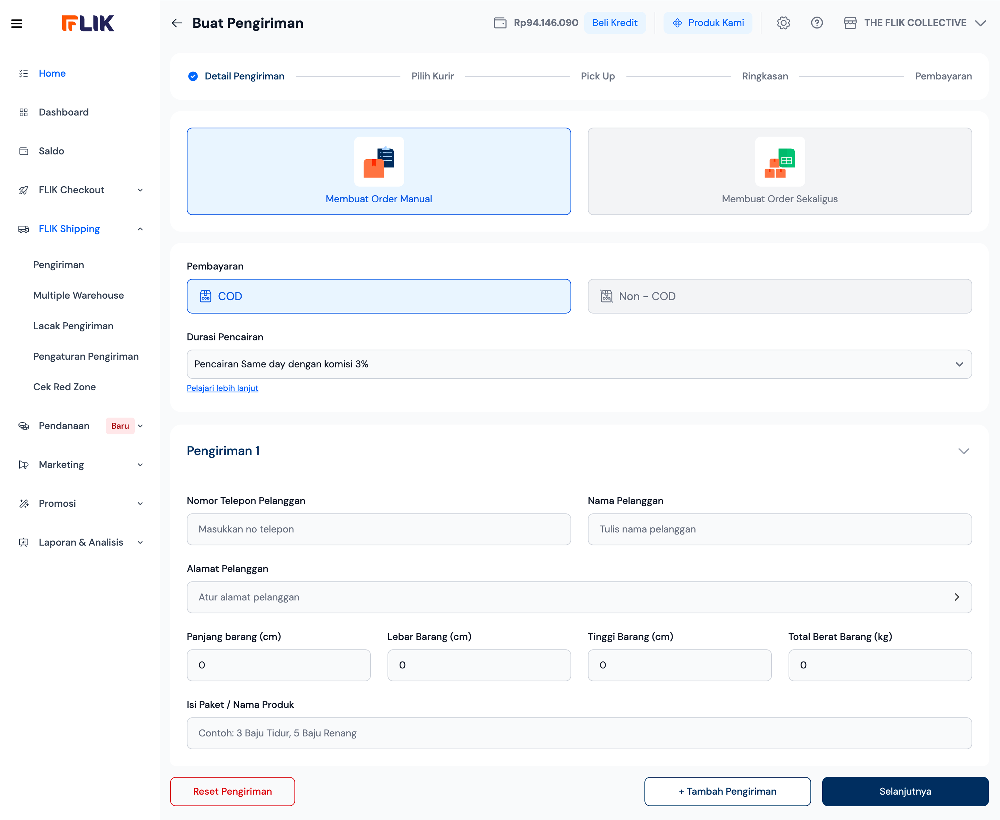
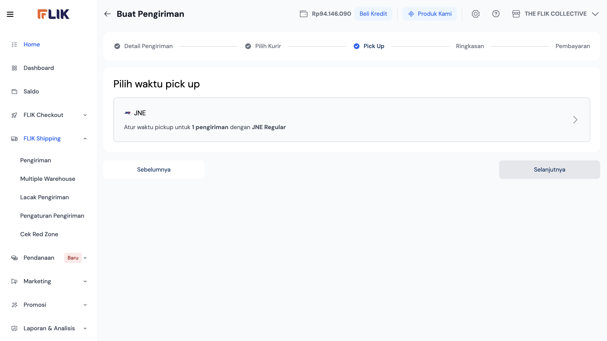
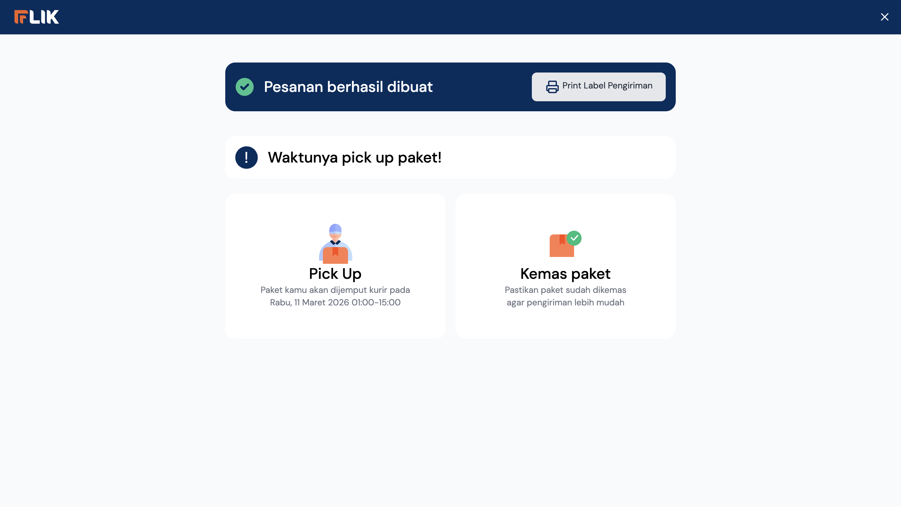

# FLIK Shipping: Merchant Dashboard Design Gap Analysis

**Author:** VP of Product (AI Persona)  
**Target Audience:** Engineering, Product, and Design Teams  
**Date:** March 10, 2026

## Executive Summary
FLIK Shipping is positioned as a shipping aggregator for Indonesian social commerce and D2C merchants. While the UI is clean and modern, the current "Wizard-based" flow is optimized for low-volume sellers (1-10 orders/day) and presents significant friction for mid-market merchants (100-500 orders/day). To scale, FLIK must transition from a manual entry tool to an automated shipping engine.

---

## 1. Reconstructed Merchant Journey
Based on the UI analysis, the merchant follows a linear 5-step fulfillment process:

1.  **Origin Selection**: Choosing the warehouse/pickup point.
2.  **Order Entry**: Manual or Bulk input of customer and package data.
3.  **Courier Selection**: Real-time rate comparison and service selection.
4.  **Pickup Scheduling**: Selecting a date and time window for the courier.
5.  **Payment & Printing**: Final summary, payment via Saldo, and label generation.

---

## 2. UX and Product Evaluation
| Metric | Rating | Observation |
| :--- | :--- | :--- |
| **Information Hierarchy** | High | Clear cards and steps; easy for beginners to follow. |
| **Clarity** | Medium | Good visual feedback, but some logic (COD Fees) is delayed. |
| **Speed/Efficiency** | Low | Too many screens and manual inputs for power users. |
| **Decision Support** | Medium | "Paling Murah" badge is helpful; needs "Success Rate" metrics. |

---

## 3. Critical Product Gaps
*   **Address Validation**: Lack of automated sub-district (Kecamatan) verification leads to high RTO rates.
*   **Package Presets**: No ability to save standard box sizes (e.g., "Small Box", "Large Mailer").
*   **Contextual Red Zone Checks**: Warnings are siloed in a separate menu rather than integrated into the checkout flow.
*   **Financial Flow**: COD value entry is requested at the summary stage instead of the input stage, leading to recalculations.

---

## 4. Flow Friction Analysis (The "Big 5")

### 1. Manual Address Entry (Screen 5)
For social sellers (WhatsApp/IG), re-typing addresses is the #1 time-sink.
*   **Impact**: High Friction, High Error Rate.

### 2. Static Package Dimensions (Screen 5)
Forcing merchants to enter 9x9x9 and weight for every single "Manual" order.
*   **Impact**: Slows down fulfillment for D2C brands.

### 3. Disjointed Pickup Selection (Screens 9-10)
Splitting pickup selection into two distinct click actions.
*   **Impact**: Unnecessary clicks.

### 4. Late-Stage Financial Input (Screen 11)
Entering the COD value at the "Ringkasan" (Summary) stage.
*   **Impact**: Confuses users about final pricing until the very end.

### 5. Saldo Gatekeeping (Screen 12)
Hard stop if balance is insufficient.
*   **Impact**: High drop-off rate at the final step.

---

## 5. Strategic Recommendations

1.  **Smart Address Parser**: Allow merchants to paste raw text from WhatsApp/Instagram.
2.  **Courier Success Rates**: Show "Success %" alongside price to help merchants avoid unreliable couriers.
3.  **Bulk "One-Click" Approve**: Allow bulk approval of shipments using "Cheapest" or "Favorite" couriers.
4.  **Integrated Top-up**: Add a "Top up & Confirm" button if Saldo is low.

---

## 6. Visual Reference (Sample Screens)

| Step 1: Manual Entry | Step 2: Rate Comparison | Step 3: Success |
| :---: | :---: | :---: |
|  |  |  |

---

## 7. Industry Benchmarks
*   **Shippo/ShipStation**: Lead with "Automation Rules" (e.g., *If Weight < 1kg -> Use JNE Regular*).
*   **Shopify Shipping**: Uses deep integration with the order book to eliminate manual typing entirely.
*   **Shipper ID**: Excels in multi-warehouse optimization and integrated RTO insurance.
